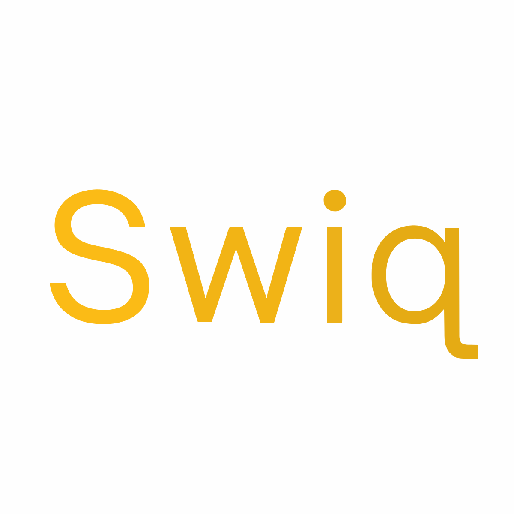

# Swiq

<div align="center">
  
</div>

Swiq is a custom programming language engine built entirely from scratch in C++. It features a recursive-descent parser, a tree-walking interpreter, deterministic lexical scoping rules via explicit closure captures, and a native system-state control machine.

## Core Language Concepts

### 1. State Management (`reset`, `delete`, `archive`, `restore`)
Swiq features keyword-level state controls baked directly into the interpreter engine to manage variable life cycles explicitly:
* `reset x;` — Instantly rolls a variable back to its initial value when it was first declared.
* `delete x;` — Erases a variable completely from the active runtime context.
* `archive x;` — Moves a variable out of the active scope map and places it into an isolated archival map. While a variable is archived, it cannot be read from or assigned to.
* `restore x;` — Pulls an archived variable back into the active runtime context with its previous state intact.

### 2. Explicit Closure Captures
Unlike traditional languages where functions implicitly inherit the outer lexical scope, Swiq functions execute in an isolated environment by default. To access outer variables, you must explicitly state them inside a capture list `[...]`, giving you absolute control over side effects:
```swiq
set var counter = 0;

// Explicitly capture 'counter' for read/write access
func increment()[counter] {
    set counter = counter + 1;
    return counter;
}
```

### 3. Strict Tagged Objects & Interfaces

Every object literal in Swiq must match a strict structural blueprint defined by a `type` or an `interface`, using the `{ field: value }<TypeName>` allocation syntax.

* `type`: Structural templates. Unspecified fields implicitly fallback to `null`.
* `interface`: Strict contracts. All fields must have default declarations or be provided explicitly upon construction, or the engine throws a runtime error.

## Features

* **Variables**: `set var x = 5;` to declare, `set x = 10;` to reassign
* **Advanced State Operators**: `reset`, `delete`, `archive`, and `restore`
* **Arithmetic Engine**: operator precedence handling for `+`, `-`, `*`, `/`
* **Data Types**: Strings (with `+` concatenation), Booleans (`true`/`false`), and Numbers
* **Type Modifiers**: Constraints such as `<integerOnly>` and `<floatOnly>` applied to types and interfaces
* **Comparisons**: `==`, `!=`, `<`, `>`, `<=`, `>=`
* **Control Flow**: `if-else` conditionals, `while` loops, and fully scoped `for` loops
* **Functions**: Recursion support, isolated scopes, and explicit lambda-like captures
* **Arrays**: Standard array allocation `[1, 2, 3]`, native index mapping `arr[0]`, and index updating `set arr[0] = 99;`
* **File System Modules**: Dynamic module importing via the `@import "path.swiq";` directive
* **Built-in Operations**: `len(arr)`, `push(arr, value)`, and console writing via `log()`
* **System Diagnostics**: Core read-only environment namespaces (`Swiq.__ENV__...`) available out of the box

## Code Examples

### State Archiving & Restoration

```swiq
set var data = 100;

archive data;
// log(data); ❌ Error: variable 'data' is currently archived!

restore data;
log(data); // Output: 100
```

### Object Types & Interface Constraints

```swiq
interface Guard {
    id: 1000,
    modifier: Number<integerOnly>
}

// Instantiate matching object literal tagged with its interface
set var player = { id: 55 }<Guard>;
log(player.id); // Output: 55
```

### Functions and Recursion

```swiq
func factorial(n) {
    if (n <= 1) {
        return 1;
    }
    return n * factorial(n - 1);
}

log(factorial(5)); // Output: 120
```

### Arrays and Iteration

```swiq
set var arr = [10, 20, 30];
push(arr, 40);

set var sum = 0;
for (set var i = 0; i < len(arr); set i = i + 1) {
    set sum = sum + arr[i];
}

log(sum); // Output: 100
```

## Building

Ensure you have a modern C++ compiler supporting standard library variants and smart pointers (`C++17` or higher), along with CMake installed.

```bash
mkdir build && cd build
cmake ..
make
./swiq ../examples/hello.swiq
```

To view versioning and build flags:

```bash
./swiq -v
```

## Contributing

Contributions are highly welcome! Please make sure to check out our repository standards:
* `CONTRIBUTING.md` for standard style guides and token/AST processing architectures.
* `SECURITY.md` to review how Swiq isolates variable scopes and handle safe pointer execution rules.
