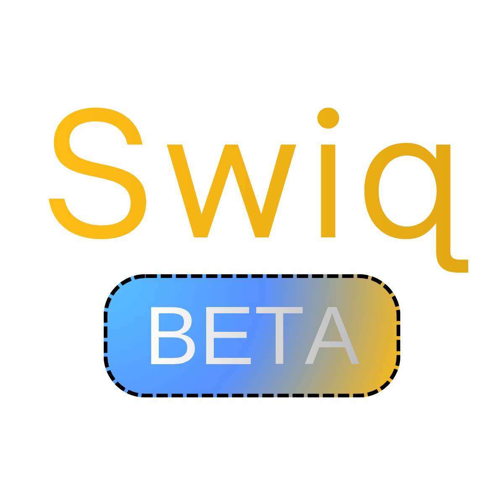

<div align="center">
  
</div>

---

Swiq is a **programming language** made by *bananakitssu*

The syntax is similar to these languages:
* C++/C#/C
* Python
* Kotlin
* Lua/Luau
* JavaScript/TypeScript

---

# Documentation

## Downloading Swiq

> [!NOTE]
> You would need `cmake` and `make` installed

To download Swiq onto your device, download the ZIP file, extract it, then go into the extracted folder:

```bash
cd Swiq
```

Then make a new directory called `build` and go into that folder:

```bash
mkdir build && cd build
```

Then run **CMake** and build it with `make`:

```bash
cmake .. && make
```

You now have Swiq as an executable file, to move it run:
```bash
mv ./swiq to/another/directory
```
or to copy it, run:
```bash
cp ./swiq to/another/directory
```

or add it to your system completely (Works for MacOS or Linux):
```swiq
cp ./swiq /usr/local/bin/swiq && sudo chmod +x /usr/local/bin/swiq
```

> [!NOTE]
> To get Swiq working on Windows, you will have to add ***Swiq*** to the *Environment Variables*

> [!NOTE]
> To get it in Android Termux, run:
> ```bash
> cp ./swiq /data/data/com.termux/files/usr/bin/swiq
> ```
---
> [!TIP]
> ***(This is if you have added Swiq to your system completely)***
> 
> You can run your Swiq file by:
> ## MacOS / Linux
> 
> ### 1. Adding a shebang at the top of the file:
> ```swiq
> #!/usr/local/bin/swiq
> ```
> 
> ### 2. Then Making it executable:
> ```bash
> chmod +x ./file_name.swiq
> ```
> 
> ### 3. Then running it with:
> ```bash
> ./file_name.swiq
> ```
>
> ## Termux
> (Similar to Linux)
>
> ### 1. Adding a shebang at the top of the file:
> ```swiq
> #!/data/data/com.termux/files/usr/bin/swiq
> ```
>
> ### 2. Then making it executable:
> ```bash
> chmod +x ./file_name.swiq
> ```
>
> ### 3. Then running it with:
> ```bash
> ./file_name.swiq
> ```
> 
> ## Windows
> 
> ### 1. Just run it with Swiq:
> ```bash
> swiq ./file_name.swiq
> ```
---

## Swiq commands

There are currently **2** commands in Swiq.

For getting the Swiq version:
```bash
./swiq -v
```

For running a Swiq script:
```bash
./swiq <file>
```
> [!TIP]
> Or
> ```bash
> swiq <file>
> ```
> If you added it to your device

## Variables

Now let's see how we can create/update variables.

### Normal Variables

To create **readable** and **writeable** variables:

```swiq
set var x = 5;
```

* `set var` creates the variable
* `x` is the variable name
* `5` is the variable value

---

### Protected Variables

To create protected variables, that are **read-only**:

```swiq
set var<Protected> x = 5;
```

* `set var` creates the variable
* `<Protected>` protects the variable, making it *read-only*
* `x` is the variable name
* `5` is the variable value

---

### Local/Global variables

If the script would need to be imported to another script, you can choose what variables it can see and what variables it cannot:

```swiq
set local var x = 5;
```

* `set local var` creates the variable but it's local and only avaliable to the current script, not shown when imported
* `x` is the variable name
* `5` is the variable value

To make it **global** *(This is the default)*:

```swiq
set global var x = 5;
```

* `set global var` creates the variable globally
* `x` is the variable name
* `5` is the variable value

---

### Changing a variable's value

To change a variables value, that do not have `<Protected>` you have to just only use `set`:
```swiq
set x = 10;
```

---

## Math

Swiq supports multiplying (`*`), dividing (`/`), adding (`+`) and substracting (`-`)

Examples:

### Multiplying
```swiq
// 10 * 10
log(10 * 10);
```
Output:
```
100
```

---

### Dividing
```swiq
// 6 / 2
log(6 / 2);
```
Output:
```
3
```

---

### Adding
```swiq
// 5 + 5
log(5 + 5);
```
Output:
```
10
```

---

### Substracting
```swiq
// 10 - 5
log(10 - 5);
```
Output:
```
5
```

Oh wait you might already know this—

---

## Functions

Now let's see how to create/run functions and run built-in functions:

### Creating a function (Without access to outside variables)

To create a function without access to outside variables is simple:

```swiq
func myFunction (arg1, arg2) {
  // code here
}
```

* `func` creates the function
* `myFunction` is the function name
* `arg1` is the parameter name, which is a variable accessible to the function, it's value depends on what data is sent while calling the function
* `,` is the parameter separater
* `arg2` is another parameter name

---

### Creating a function (With access to outside variables)

Creating a function with access to outside variables are different than functions without outside variable access:

```swiq
func myFunction (arg1, arg2) [x] {
  // code here
}
```

* `func` creates the function
* `myFunction` is the function name
* `arg1` is the parameter name, which is a variable accessible to the function, it's value depends on what data is sent while calling the function
* `,` is the parameter separater
* `arg2` is another parameter name
* `x` is the outside variable that the function would have access to

---

### Function returns

A function can return a value, example:

```swiq
func square(n) {
  return n * n;
}
log(square(2));
```
This would output:
```
4
```
because `square` returns a number value

---

### Running a function

Running a function is very easy, you just need to type:

```swiq
myFunction("value1", "value2");
```

* `myFunction` is the function name of what function to call
* `"value1"` is the string to pass to the function for `arg1`
* `"value2"` is the string to pass to the function for `arg2`

---

### Running built-in functions

Swiq has built-in functions:

Getting a length of an array (Returns a number):
```swiq
len(array);
```
* `array` the array variable name

Adding an item to an array:
```swiq
push(array, 5);
```
* `array` the array variable name
* `5` the item to be added

Creating a size-limited array (`push` doesn't work here):
```swiq
set var array = AllocatedArray(10);
```
* `10` is the array limited size

Printing text to the console:
```swiq
log("hi");
```
* `"hi"` is the text to be printed

Reading a file:
```swiq
set var result = readFile("path/to/file.txt");
```
* `"path/to/file.txt"` the path to the file

---

## Arrays

Now let's look at arrays:

### Creating a normal array:

```swiq
set var array = [10, 5];
```
* `10` is the first value in the array
* `5` is the second value in the array

---

### About creating an allocated array:

Creating an allocated array was already stated in the `Functions -> Running built-in functions` section. Here's some notes:

> [!NOTE]
> * When creating an allocated array would fill the array with `null` up to the size of the allocated array
> * The array would have the size limit
> * Push cannot work, it would throw an error

---

## Variable Memory Management

Now let's see how to reset/delete/archive/restore variables:

### Resetting a variable:

You can reset a variable to it's initial value
The initial value of a variable is the value used when creating the variable

```swiq
reset x;
```
* `reset` resets the given variable
* `x` is the variable to be reset

---

### Deleting a variable:

This deletes the variable

```swiq
delete x;
```
* `delete` deletes the given variable
* `x` is the variable to be deleted

---

### Archiving a variable:

Archiving a variable moves the variable into another space that your code can't find until you restore it

```swiq
archive x;
```
* `archive` archives the given variable
* `x` is the variable to be archived

---

### Restoring a variable:

You can restore a variable after archiving it:

```swiq
restore x;
```
* `restore` restores the given variable
* `x` is the variable to be restored

---

## For loops / While loops / If blocks

Now let's look at for/while loops and if blocks

### For loops

For loops runs until a **condition** (a true or false statement) is false

Example:
```swiq
for (set var i = 0; i < 10; set i = i + 1) {
  // code here
}
```
* the `i` variable is the variable used by the for loop for **condition checking**
* `i < 10` makes a comparison of if `i` is under 10, if not, the for loop will stop, if is, the for loop will continue
* `set i = i + 1` changes `i` by 1 until it reaches 10

> [!NOTE]
> The for loop can get access to the `i` variable

---

### While loops

While loops is like for loops but ends if a variable is false

Example:
```swiq
set var x = true;
while (x) {
  // code here
}
```
> [!NOTE]
> When using the while loop, you can use `true` or `false` instead of a variable:
> ```swiq
> while (true) {
>   // code here
> }
> ```

---

### If blocks

If blocks runs code if a **condition** is true

Example:
```swiq
if (null == none) {
  // code here
}
```
* `null` means *"No value"*
* `==` is comparing if the value on the left equals to the value on the right
* `none` also means *"No value"*

> [!NOTE]
> More information comming soon

---

> [!IMPORTANT]
> * You cannot have nested functions (a function in a function, will be a feature soon)
> * You cannot capture all variables at once with just `[&]`, that will be a feature soon

# Changelog

No published releases

> [!IMPORTANT]
> Swiq is still under-development
